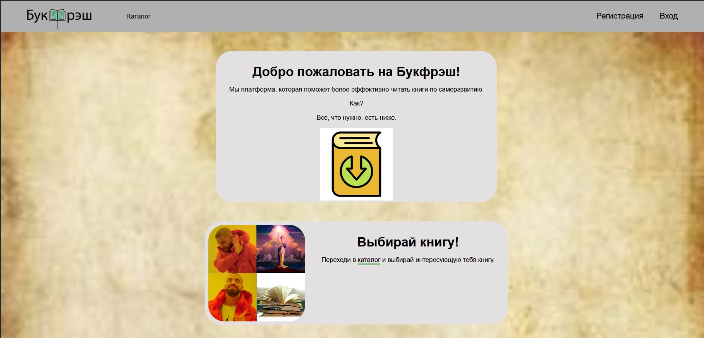
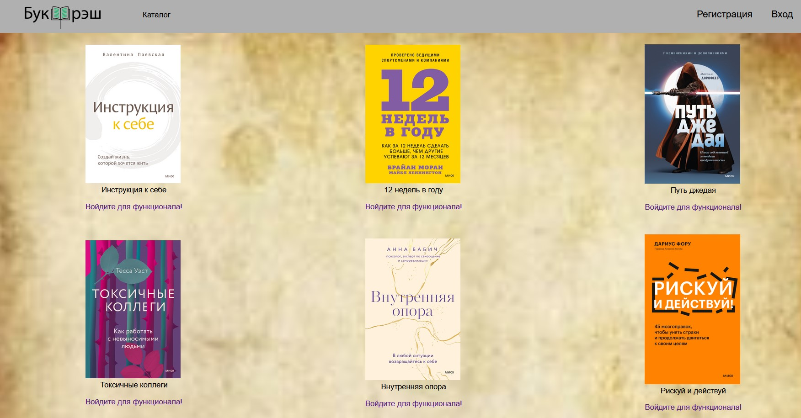
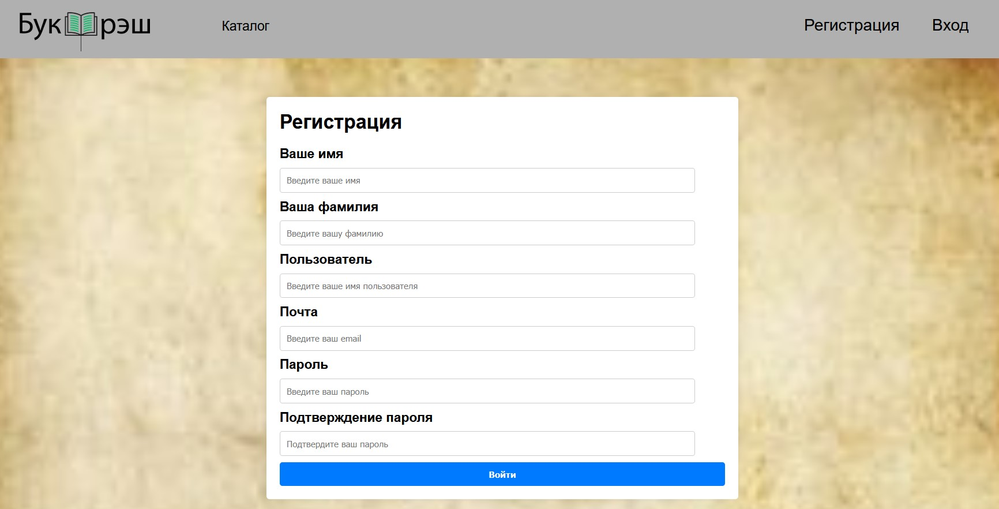

# my_site

Этот проект -- задание по дисциплине Основы Web-технологий. 
Однако всё связанное с django -- результат самообразования: нам дали возможность взять любой язык для backend части, но разобраться нужно было во всём самостоятельно.

## Используемые технологии: 
HTML, CSS, JavaScript (совсем чуть-чуть), django.

## Функционал

- Разные страницы для зарегистрированных и незарегистрированных пользователей. 
- Формы регистрации и входа.

## Скриншоты

